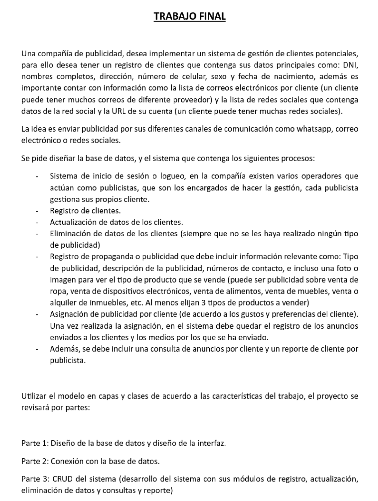
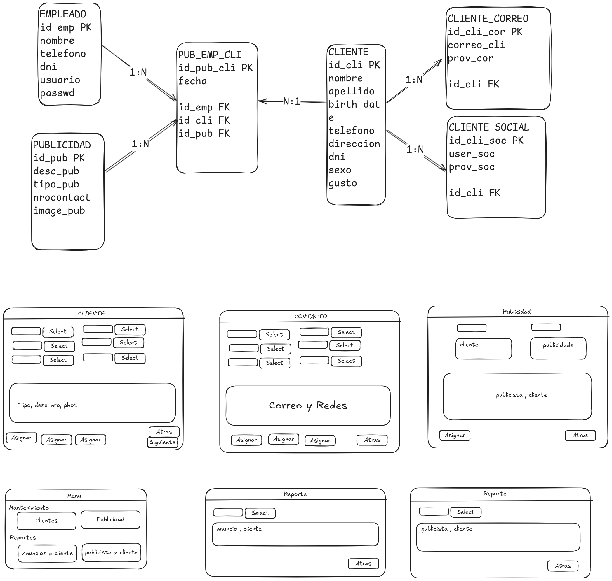

# Trabajo final: Agencia de publicidad

Integrantes:
- Adan Elio Chambi Mamani
- Andy Nelson Barreda Vilcahuaman
- Juan Franklin Huamanga Torres

## Planteamiento



## Bocetos



## Script de la Base de datos

```sql
	CREATE TABLE EMPLEADO (
    id_emp SERIAL PRIMARY KEY,
    nombre VARCHAR(100) NOT NULL,
    telefono VARCHAR(20) NOT NULL,
    dni VARCHAR(20) NOT NULL,
    usuario VARCHAR(50) NOT NULL,
    passwd VARCHAR(100) NOT NULL
);

CREATE TABLE PUBLICIDAD (
    id_pub SERIAL PRIMARY KEY,
    descp TEXT NOT NULL,
    tipo VARCHAR(50) NOT NULL,
    contacto INT NOT NULL,
    imagen TEXT NOT NULL
);

CREATE TABLE CLIENTE (
    id_cli SERIAL PRIMARY KEY,
    nombre VARCHAR(100) NOT NULL,
    apellido VARCHAR(100) NOT NULL,
    birthdate DATE NOT NULL,
    telefono VARCHAR(20) NOT NULL,
    direccion TEXT NOT NULL,
    dni VARCHAR(20) NOT NULL,
    sexo VARCHAR(10) NOT NULL,
    gusto TEXT NOT NULL
);

CREATE TABLE PUB_EMP_CLI (
    id_pub_cli SERIAL PRIMARY KEY,
    fecha DATE NOT NULL,
    id_emp INT NOT NULL,
    id_cli INT NOT NULL,
    id_pub INT NOT NULL,
    CONSTRAINT fk_pubempcli_empleado FOREIGN KEY (id_emp) REFERENCES EMPLEADO(id_emp),
    CONSTRAINT fk_pubempcli_cliente FOREIGN KEY (id_cli) REFERENCES CLIENTE(id_cli),
    CONSTRAINT fk_pubempcli_publicidad FOREIGN KEY (id_pub) REFERENCES PUBLICIDAD(id_pub)
);

CREATE TABLE CLIENTE_CORREO (
    id_cli_cor SERIAL PRIMARY KEY,
    correo VARCHAR(100) NOT NULL,
    proveedor VARCHAR(50) NOT NULL,
    id_cli INT NOT NULL,
    CONSTRAINT fk_clientecorreo_cliente FOREIGN KEY (id_cli) REFERENCES CLIENTE(id_cli)
);

CREATE TABLE CLIENTE_SOCIAL (
    id_cli_soc SERIAL PRIMARY KEY,
    usuario VARCHAR(100) NOT NULL,
    proveedor VARCHAR(50) NOT NULL,
    id_cli INT NOT NULL,
    CONSTRAINT fk_clientesocial_cliente FOREIGN KEY (id_cli) REFERENCES CLIENTE(id_cli)
);

CREATE VIEW pubclientes AS
SELECT 
    c.id_cli,
    c.nombre || ' ' || c.apellido AS cliente,
    p.id_pub,
    p.descp AS descripcion_anuncio,
    p.tipo,
    pec.fecha
FROM PUB_EMP_CLI pec
JOIN CLIENTE c ON pec.id_cli = c.id_cli
JOIN PUBLICIDAD p ON pec.id_pub = p.id_pub
ORDER BY c.id_cli, pec.fecha;

CREATE VIEW pubclientes2 AS
SELECT 
    c.id_cli,
    c.nombre AS cliente,
    p.id_pub,
    p.descp AS descripcion_anuncio,
    p.tipo,
    pec.fecha
FROM PUB_EMP_CLI pec
JOIN CLIENTE c ON pec.id_cli = c.id_cli
JOIN PUBLICIDAD p ON pec.id_pub = p.id_pub
ORDER BY c.id_cli, pec.fecha;

-- Ver clientes atendidos por empleados
CREATE VIEW cliempleados AS
SELECT 
    e.id_emp,
    e.nombre AS empleado,
    c.id_cli,
    c.nombre || ' ' || c.apellido AS cliente,
    pec.fecha
FROM PUB_EMP_CLI pec
JOIN EMPLEADO e ON pec.id_emp = e.id_emp
JOIN CLIENTE c ON pec.id_cli = c.id_cli
ORDER BY e.id_emp, pec.fecha;

-- Ver las redes sociales y correos de los clientes
CREATE VIEW redcorclientes AS
SELECT 
    c.id_cli,
    c.nombre || ' ' || c.apellido AS cliente,
    COALESCE(correos.correos, 'Sin correos') AS correos,
    COALESCE(redes.redes_sociales, 'Sin redes') AS redes_sociales
FROM CLIENTE c
LEFT JOIN (
    SELECT id_cli, STRING_AGG(correo || ' (' || proveedor || ')', ', ') AS correos
    FROM CLIENTE_CORREO
    GROUP BY id_cli
) correos ON c.id_cli = correos.id_cli
LEFT JOIN (
    SELECT id_cli, STRING_AGG(usuario || ' (' || proveedor || ')', ', ') AS redes_sociales
    FROM CLIENTE_SOCIAL
    GROUP BY id_cli
) redes ON c.id_cli = redes.id_cli
ORDER BY c.id_cli;

select * from cli_empleados;

CREATE or replace VIEW cli_empleados AS
SELECT 
    e.id_emp,
    e.nombre AS empleado,
    c.id_cli,
    c.nombre as cliente,
    pec.fecha
FROM PUB_EMP_CLI pec
JOIN EMPLEADO e ON pec.id_emp = e.id_emp
JOIN CLIENTE c ON pec.id_cli = c.id_cli
JOIN PUBLICIDAD p ON pec.id_pub = p.id_pub
ORDER BY e.id_emp, pec.fecha;

```

## Diseño

Este proyecto trabajo final presenta un diseño basado en capas:

- [Capa de Datos](<#Capa de Datos>) Conexion a base de datos.
- [Capa de Entidades](<#Capa de Entidades>) Declaracion de variables de entidades a usar.
- [Capa de Interfaces](<#Capa de Interfaces>) Firma de metodos a usar.
- [Capa de Logica](<#Capa de Logica>) Logica de negocio concentrada para cada proposito.
- [Capa de Presentacion](<#Capa de Presentacion>) Vista final del programa.

### Capa de Datos

Encapsulacion de la logica para la conexion a la base de datos para poder rehutilizar el codigo.
Uso del driver de conexion a una base de datos hecha en postgresql.

```java
package datos;

import java.sql.Connection; 
import java.sql.DriverManager;
import java.sql.SQLException;

public class DB {
	private String url = "jdbc:postgresql://localhost/agenpub2";
	private String user = "postgres";
	private String password = "123";
	
	public Connection conectar() throws SQLException {
		Connection cn = DriverManager.getConnection(url,user,password);
		return cn;
	}
}  
```

### Capa de Entidades

Declaracion de las clases a usar, relacionada a la estructura de datos a usar en el programa.

```java

package entidades;

import java.util.Date;

public class Cliente {
	// entidad para el crud clientes
	private int id_cli;
	private String nombre;
	private String apellido;
	private Date birthdate;
	private String telefono;
	private String direccion;
	private String dni;
	private String sexo;
	private String gusto;
		
	public Cliente() {
		super();
	}

	public Cliente(int id_cli, String nombre, String apellido, String telefono, String direccion, String dni,
			String sexo, Date birthdate, String socialmedia, String gusto) {
		super();
		this.id_cli = id_cli;
		this.nombre = nombre;
		this.apellido = apellido;
		this.birthdate = birthdate;
		this.telefono = telefono;
		this.direccion = direccion;
		this.dni = dni;
		this.sexo = sexo;
		this.gusto = gusto;
		
	}

	public int getId_cli() {
		return id_cli;
	}

	public void setId_cli(int id_cli) {
		this.id_cli = id_cli;
	}

	public String getNombre() {
		return nombre;
	}

	public void setNombre(String nombre) {
		this.nombre = nombre;
	}

	public String getApellido() {
		return apellido;
	}

	public void setApellido(String apellido) {
		this.apellido = apellido;
	}

	public String getTelefono() {
		return telefono;
	}

	public void setTelefono(String telefono) {
		this.telefono = telefono;
	}

	public String getDireccion() {
		return direccion;
	}

	public void setDireccion(String direccion) {
		this.direccion = direccion;
	}

	public String getDni() {
		return dni;
	}

	public void setDni(String dni) {
		this.dni = dni;
	}

	public String getSexo() {
		return sexo;
	}

	public void setSexo(String sexo) {
		this.sexo = sexo;
	}

	public java.util.Date getBirthDate() {
		return birthdate;
	}

	public void setBirthDate( java.util.Date birthdate) {
		this.birthdate = birthdate;
	}
	
	public String getGusto() {
		return gusto;
	}
	
	public void setGusto(String gusto) {
		this.gusto = gusto;
	}
	
	@Override
	public String toString() {
		// TODO Auto-generated method stub
		return this.nombre;
	}
}
```

### Capa de Interfaces

Integra firmas de metodos para separar el requerimiento del funcionamiento. Garantizando abstraccion, reutilizacion, mantenimiento y polimorfismo que favorece un código limpio, y con buenas practicas.

```java
package interfaces;

import java.sql.SQLException;
import java.util.List;

import entidades.Cliente;

public interface ICliente {
	void guardar(Cliente cliente) throws SQLException;
	void modificar(Cliente cliente) throws SQLException;
	void eliminar(String id) throws SQLException;
	
	List<Cliente> cargar() throws SQLException;
}

```

### Capa de Logica

Punto Medio entre la Presentacion/Vista que se encarga de la logica de negocio gestionando los metodos, guardar, modificar, eliminar y cargar. Coordina el acceso y aisla a la base de Datos.

```java
package logica;

import java.sql.Connection;
import java.sql.PreparedStatement;
import java.sql.ResultSet;
import java.sql.SQLException;
import java.util.ArrayList;
import java.util.List;

import datos.DB;
import entidades.Cliente;
import interfaces.ICliente;

public class LCliente implements ICliente{
	Connection cn;
	PreparedStatement ps;
	ResultSet rs;
	DB db;
	
	@Override
	public void guardar(Cliente cliente) throws SQLException {
		// TODO Auto-generated method stub
		db=new DB();
		cn=db.conectar();
		String sql = "insert into cliente (nombre, apellido, birthdate, telefono, direccion, dni, sexo, gusto) values(?,?,?,?,?,?,?,?)";
		ps = cn.prepareStatement(sql);
		ps.setString(1, cliente.getNombre());
		ps.setString(2, cliente.getApellido());
		ps.setDate(3, new java.sql.Date(cliente.getBirthDate().getTime()));
		ps.setString(4, cliente.getTelefono());
		ps.setString(5, cliente.getDireccion());
		ps.setString(6, cliente.getDni());
		ps.setString(7, cliente.getSexo());
		ps.setString(8, cliente.getGusto());
		ps.execute();
		cn.close();
	}

	@Override
	public void modificar(Cliente cliente) throws SQLException {
		// TODO Auto-generated method stub
		db=new DB();
		cn=db.conectar();
		String sql = "update cliente set nombre=?, apellido=?, birthdate=?, telefono=?, direccion=?, dni=?, sexo=?, gusto=? where id_cli=? ";
		ps = cn.prepareStatement(sql);
		ps.setString(1, cliente.getNombre());
		ps.setString(2, cliente.getApellido());
		ps.setDate(3, new java.sql.Date(cliente.getBirthDate().getTime()));
		ps.setString(4, cliente.getTelefono());
		ps.setString(5, cliente.getDireccion());
		ps.setString(6, cliente.getDni());
		ps.setString(7, cliente.getSexo());
		ps.setString(8, cliente.getGusto());
		ps.setInt(9, cliente.getId_cli());
		ps.execute();
		cn.close();
	}

	@Override
	public void eliminar(String id) throws SQLException {
		db = new DB();
		cn = db.conectar();
		String sql = "delete from cliente where id_cli=?";
		ps = cn.prepareStatement(sql);
		ps.setInt(1, Integer.parseInt(id));
		ps.executeUpdate();
		cn.close();
	}

	@Override
	public List<Cliente> cargar() throws SQLException {
		// TODO Auto-generated method stub
		List<Cliente> clientes = new ArrayList<Cliente>();
		db=new DB();
		cn=db.conectar();
		String sql = "select id_cli, nombre, apellido, birthdate, telefono, direccion, dni, sexo, gusto from cliente";
		ps = cn.prepareStatement(sql);
		rs = ps.executeQuery();
		while (rs.next()){
			Cliente cli = new Cliente();
			cli.setId_cli(rs.getInt(1));
			cli.setNombre(rs.getString(2));
			cli.setApellido(rs.getString(3));
			cli.setBirthDate(rs.getDate(4));
			cli.setTelefono(rs.getString(5));
			cli.setDireccion(rs.getString(6));
			cli.setDni(rs.getString(7));
			cli.setSexo(rs.getString(8));
			cli.setGusto(rs.getString(9));
			clientes.add(cli);
		}
		cn.close();
		return clientes;
	}

}
```

### Capa de Presentacion

Implementacion de una interfaz grafica para la invocacion de los metodos Guardar, modificar, eliminar y mostrar.
Captura y validadcion de datos ingresados a travez de la interfaz.
Uso de la libreria Java Swing y la herramienta externa JCalendar.

```java


import java.awt.EventQueue;
import java.awt.Font;
import java.awt.event.ActionEvent;
import java.awt.event.ActionListener;
import java.sql.SQLException;
import java.text.ParseException;
import java.text.SimpleDateFormat;
import java.util.List;

import javax.swing.JFrame;
import javax.swing.JPanel;
import javax.swing.border.EmptyBorder;
import javax.swing.table.DefaultTableModel;

import com.toedter.calendar.JDateChooser;

import entidades.Cliente;
import interfaces.ICliente;
import logica.LCliente;

import javax.swing.JLabel;
import javax.swing.JOptionPane;
import javax.swing.JTextField;
import javax.swing.JScrollPane;
import javax.swing.JButton;
import javax.swing.JTable;

public class FManCliente extends JFrame {

	private static final long serialVersionUID = 1L;
	private JPanel contentPane;
	private JTextField txtid;
	private JTextField txtnombres;
	private JTextField txtapellidos;
	private JDateChooser dcbirthdate;
	private JTextField txttelefono;
	private JTextField txtdirec;
	private JTextField txtdni;
	private JTextField txtsexo;
	private JTextField txtgusto;
	private JTable grilla_clientes;

	/**
	 * Launch the application.
	 */
	public static void main(String[] args) {
		EventQueue.invokeLater(new Runnable() {
			public void run() {
				try {
					FManCliente frame = new FManCliente();
					frame.setVisible(true);
				} catch (Exception e) {
					e.printStackTrace();
				}
			}
		});
	}

	/**
	 * Create the frame.
	 */
	public FManCliente() {
		setTitle("Mantenimiento de Clientes");
		setDefaultCloseOperation(JFrame.EXIT_ON_CLOSE);
		setBounds(100, 100, 700, 500);
		contentPane = new JPanel();
		contentPane.setBorder(new EmptyBorder(5, 5, 5, 5));

		setContentPane(contentPane);
		contentPane.setLayout(null);
		
		JLabel lblID = new JLabel("ID");
		lblID.setFont(new Font("Iosevka", Font.PLAIN, 14));
		lblID.setBounds(10, 12, 54, 16);
		contentPane.add(lblID);
		
		JLabel lblNom = new JLabel("Nombres");
		lblNom.setFont(new Font("Iosevka", Font.PLAIN, 14));
		lblNom.setBounds(10, 40, 70, 16);
		contentPane.add(lblNom);
		
		JLabel lblSurN = new JLabel("Apellidos");
		lblSurN.setFont(new Font("Iosevka", Font.PLAIN, 14));
		lblSurN.setBounds(10, 68, 70, 16);
		contentPane.add(lblSurN);
		
		JLabel lblBirth = new JLabel("Fecha de nacimiento");
		lblBirth.setFont(new Font("Iosevka", Font.PLAIN, 14));
		lblBirth.setBounds(250, 14, 70, 16);
		contentPane.add(lblBirth);
		
		JLabel lblTel = new JLabel("Telefono");
		lblTel.setFont(new Font("Iosevka", Font.PLAIN, 14));
		lblTel.setBounds(250, 42, 70, 16);
		contentPane.add(lblTel);
		
		JLabel lblDirec = new JLabel("Direccion");
		lblDirec.setFont(new Font("Iosevka", Font.PLAIN, 14));
		lblDirec.setBounds(250, 72, 70, 16);
		contentPane.add(lblDirec);
		
		JLabel lblDni = new JLabel("Dni");
		lblDni.setFont(new Font("Iosevka", Font.PLAIN, 14));
		lblDni.setBounds(491, 14, 54, 16);
		contentPane.add(lblDni);
		
		JLabel lblSexo = new JLabel("Sexo");
		lblSexo.setFont(new Font("Iosevka", Font.PLAIN, 14));
		lblSexo.setBounds(491, 42, 54, 16);
		contentPane.add(lblSexo);
		
		JLabel lblGusto = new JLabel("Gusto");
		lblGusto.setFont(new Font("Iosevka", Font.PLAIN, 14));
		lblGusto.setBounds(491, 70, 54, 16);
		contentPane.add(lblGusto);
		
		txtid = new JTextField();
		txtid.setBounds(82, 10, 125, 20);
		contentPane.add(txtid);
		txtid.setColumns(10);
		
		txtnombres = new JTextField();
		txtnombres.setColumns(10);
		txtnombres.setBounds(82, 38, 125, 20);
		contentPane.add(txtnombres);
		
		txtapellidos = new JTextField();
		txtapellidos.setColumns(10);
		txtapellidos.setBounds(82, 66, 125, 20);
		contentPane.add(txtapellidos);
		
		dcbirthdate = new JDateChooser();
		dcbirthdate.setBounds(322, 8, 125, 20);
		dcbirthdate.setDateFormatString("yyyy-MM-dd");
		contentPane.add(dcbirthdate);
		
		txttelefono = new JTextField();
		txttelefono.setColumns(10);
		txttelefono.setBounds(322, 40, 125, 20);
		contentPane.add(txttelefono);
		
		txtdirec = new JTextField();
		txtdirec.setColumns(10);
		txtdirec.setBounds(322, 70, 125, 20);
		contentPane.add(txtdirec);
		
		txtdni = new JTextField();
		txtdni.setColumns(10);
		txtdni.setBounds(563, 12, 125, 20);
		contentPane.add(txtdni);
		
		txtsexo = new JTextField();
		txtsexo.setColumns(10);
		txtsexo.setBounds(563, 40, 125, 20);
		contentPane.add(txtsexo);
		
		txtgusto = new JTextField();
		txtgusto.setColumns(10);
		txtgusto.setBounds(563, 68, 125, 20);
		contentPane.add(txtgusto);
		
		JScrollPane scrollPane = new JScrollPane();
		scrollPane.setBounds(10, 125, 678, 325);
		contentPane.add(scrollPane);
		
		
		grilla_clientes = new JTable();
		scrollPane.setViewportView(grilla_clientes);

		grilla_clientes.getSelectionModel().addListSelectionListener(e -> {
		    if (!e.getValueIsAdjusting() && grilla_clientes.getSelectedRow() != -1) {
		        int fila = grilla_clientes.getSelectedRow();
		        cargarDatosFila(fila);
		    }
		});
		
		JButton btnGuardar = new JButton("Guardar");
		btnGuardar.setFont(new Font("Iosevka", Font.PLAIN, 14));
		btnGuardar.setBounds(12, 462, 94, 26);
		contentPane.add(btnGuardar);
		btnGuardar.addActionListener(e -> {
			try {
				guardarCliente();
				cargarClientes();
			} catch (SQLException ex) {
				ex.printStackTrace();
			}
		});
		
		JButton btnModificar = new JButton("Modificar");
		btnModificar.setFont(new Font("Iosevka", Font.PLAIN, 14));
		btnModificar.setBounds(118, 462, 94, 26);
		contentPane.add(btnModificar);
		btnModificar.addActionListener(e -> {
			try {
				modificarCliente();
				cargarClientes();
			} catch (SQLException ex) {
				ex.printStackTrace();
			}
		});
		
		JButton btnEliminar = new JButton("Eliminar");
		btnEliminar.setFont(new Font("Iosevka", Font.PLAIN, 14));
		btnEliminar.setBounds(224, 462, 94, 26);
		contentPane.add(btnEliminar);
		btnEliminar.addActionListener(e -> {
			try {
				eliminarCliente();
				cargarClientes();
			} catch (SQLException ex) {
				ex.printStackTrace();
			}
		});
		
		JButton btnAtras = new JButton("Atras");
		btnAtras.setFont(new Font("Iosevka", Font.PLAIN, 14));
		btnAtras.setBounds(594, 462, 94, 26);
		contentPane.add(btnAtras);
		btnAtras.addActionListener(new ActionListener() {
			
			@Override
			public void actionPerformed(ActionEvent e) {
				// TODO Auto-generated method stub
				FMenu fmenu = new FMenu();
				fmenu.setVisible(true);
				dispose();
			}
		});
		
		// initialization load table
		try {
			cargarClientes();
		} catch (SQLException e) {
			e.printStackTrace();
		}
	}
	
	private void cargarDatosFila(int fila) {
	    txtid.setText(grilla_clientes.getValueAt(fila, 0).toString());
	    txtnombres.setText(grilla_clientes.getValueAt(fila, 1).toString());
	    txtapellidos.setText(grilla_clientes.getValueAt(fila, 2).toString());

	    // Conversión segura de la fecha
	    String fechaTexto = grilla_clientes.getValueAt(fila, 3).toString();
	    try {
	        java.util.Date fecha = new SimpleDateFormat("yyyy-MM-dd").parse(fechaTexto);
	        dcbirthdate.setDate(fecha);
	    } catch (ParseException ex) {
	        ex.printStackTrace(); // Log de error. También podrías notificar al usuario.
	    }

	    txttelefono.setText(grilla_clientes.getValueAt(fila, 4).toString());
	    txtdirec.setText(grilla_clientes.getValueAt(fila, 5).toString());
	    txtdni.setText(grilla_clientes.getValueAt(fila, 6).toString());
	    txtsexo.setText(grilla_clientes.getValueAt(fila, 7).toString());
	    txtgusto.setText(grilla_clientes.getValueAt(fila, 8).toString());
	}

	private void guardarCliente() throws SQLException {
		Cliente cli = new Cliente();
		// obligar no poner el campo con un valor para el id
		if (!txtid.getText().trim().isEmpty()) {
			JOptionPane.showMessageDialog(null,
				"El campo ID se autogenera. Déjalo vacío.",
				"Aviso",
				JOptionPane.INFORMATION_MESSAGE);
			txtid.setText(""); // Limpiar el campo si es necesario
		}
		cli.setNombre(txtnombres.getText());
		cli.setApellido(txtapellidos.getText());
		cli.setBirthDate(dcbirthdate.getDate());
		cli.setTelefono(txttelefono.getText());
		cli.setDireccion(txtdirec.getText());
		cli.setDni(txtdni.getText());
		cli.setSexo(txtsexo.getText());
		cli.setGusto(txtgusto.getText());
		
		ICliente logica = new LCliente();
		logica.guardar(cli);
		JOptionPane.showMessageDialog(this, "Cliente guardado exitosamente.");
	}


	private void modificarCliente() throws SQLException {
		Cliente cli = new Cliente();
		cli.setNombre(txtnombres.getText());
		cli.setApellido(txtapellidos.getText());
		cli.setBirthDate(dcbirthdate.getDate());
		cli.setTelefono(txttelefono.getText());
		cli.setDireccion(txtdirec.getText());
		cli.setDni(txtdni.getText());
		cli.setSexo(txtsexo.getText());
		cli.setGusto(txtgusto.getText());
		ICliente log = new LCliente();
		log.modificar(cli);
		JOptionPane.showMessageDialog(null, "Datos modificados");
	}

	private void eliminarCliente() throws SQLException {
		String id = txtid.getText();
		if (id.isEmpty()) {
			JOptionPane.showMessageDialog(null, "Seleccione un cliente para eliminar.");
			return;
		}
		ICliente log = new LCliente();
		log.eliminar(id);
		JOptionPane.showMessageDialog(null, "Cliente eliminado");
	}

	private void cargarClientes() throws SQLException {
		ICliente logica = new LCliente();
		List<Cliente> lista = logica.cargar();

		DefaultTableModel model = new DefaultTableModel();
		model.addColumn("ID");
		model.addColumn("Nombre");
		model.addColumn("Apellido");
		model.addColumn("Nacimiento");
		model.addColumn("Teléfono");
		model.addColumn("Dirección");
		model.addColumn("DNI");
		model.addColumn("Sexo");
		model.addColumn("Gusto");

		for (Cliente cli : lista) {
			model.addRow(new Object[]{
				cli.getId_cli(),
				cli.getNombre(),
				cli.getApellido(),
				cli.getBirthDate(),
				cli.getTelefono(),
				cli.getDireccion(),
				cli.getDni(),
				cli.getSexo(),
				cli.getGusto()
			});
		}
		grilla_clientes.setModel(model);
	}

}
```
